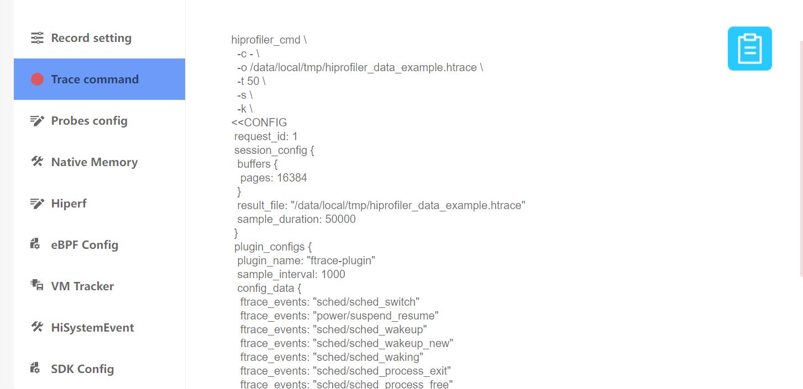
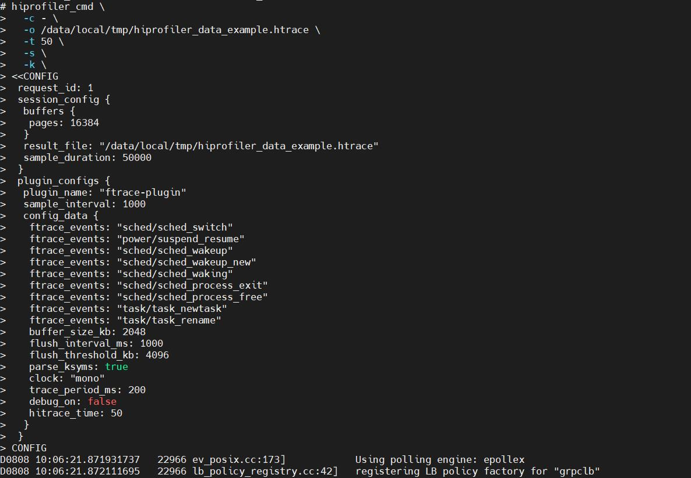

# 设备端抓取 trace 说明

从设备端抓取 trace 文件的配置和方法。

## 界面配置说明

说明：

- Record setting:设置 trace 的抓取模式，buffer size 大小，抓取时长。
- Trace command:生成的抓取命令行。
- Probes config:trace 的抓取参数配置。
- Native Memory:NativeMemory 数据的抓取参数配置。
- Hiperf:Hiperf 数据的抓取参数配置。
- eBPF Config:ebpf 数据的抓取参数配置。
- VM Tracker:smaps 数据的抓取参数配置。
- HiSystemEvent:HiSystemEvent 数据抓取参数配置。
- SDK Config:SDK 数据抓取参数配置。

## 命令行的生成和 trace 文件的抓取

点击 Probes config，如选择抓取 Scheduling details。

再点击 Record setting，在 output file path 输入文件名 hiprofiler_data_example.htrace，拖动滚动条设置 buffer size 大小是 64M，抓取时长是 50s。

点击 Trace command，就会根据上面的配置生成抓取命令，点击复制按钮，会将命令行复制。

命令参数说明：

- -o:文件的输入路径和名称。
- -t:抓取的时长。
- buffer pages:buffer size 大小。
- sample_duration:数据采集的时间。
- sample_interval:主动获取插件数据的间隔时间（ms，只针对轮询插件，例如 memory 插件，cpu 插件，dikio 插件等，对流式插件和独立插件无效）。
- trace_period_ms:ftrace 插件读取内核缓冲区数据的间隔时间（ms）。
- hitrace_time:hitrace 命令行抓取时间，与 hiprofiler_cmd 下发的-t 配置联动。

输入 hdc_std shell，进入设备，执行命令。

执行完成后，命令行会给出提示。

进入指定目录，cd /data/local/tmp 进入到目录，会看到生成的 trace 文件。

