# Native Memory 抓取和展示说明

Native Memory 是查看内存的分配和释放等情况。

## Native Memory 的抓取

### Native Memory 抓取配置参数

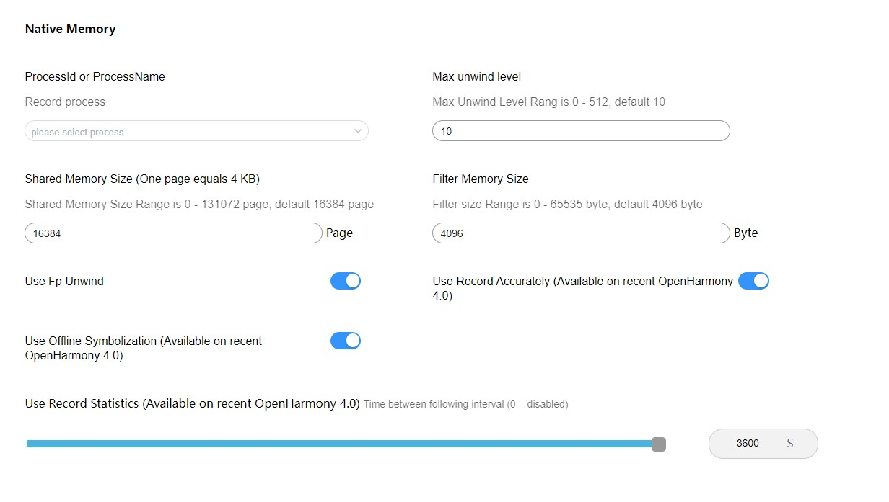
配置参数说明：

- ProcessId or ProcessName：设置抓取的进程 ID 或者进程名，此处以输入 com.ohos.mms 进程名为例。
- Max unwind level：抓取的栈的最大深度。
- Shared Memory Size：native_daemon 和 native_hook 进程之间存储数据的共享内存大小。
- Filter Memory Size：只抓取大于该 size 的 malloc 数据（free 不受影响）。
- Use Fp Unwind：Fp 回栈。
- Use Record Accurately：不过滤数据，上报全量的。
- Use Offline Symbolization：离线符号化。
- Use Record Statistics：统计数据上报。
- statistics interval：统计数据上报周期。

再点击 Record setting，在 output file path 输入文件名 hiprofiler_data_nativememory.htrace，拖动滚动条设置 buffer size 大小是 64M，抓取时长是 50s。
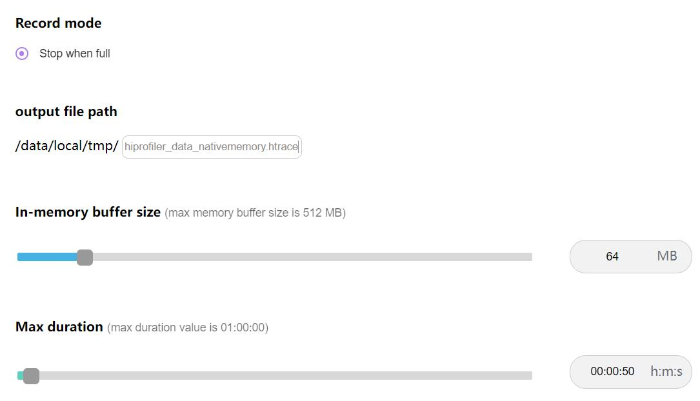

点击 Trace command，就会根据上面的配置生成抓取命令，点击复制按钮，会将命令行复制。
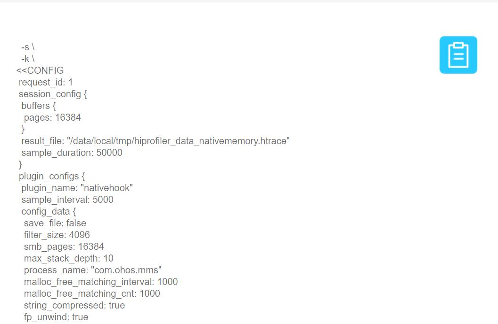

命令行参数说明：

- save_file：是否将 hook 数据保存成文件，不上报 protobuf 形式数据给 hiprofilerd。
- filter_size：过滤 malloc 的大小，最小值是 0，默认值是 4096Byte。
- smb_pages：nativedeamon 与 libnativehook 间的共享内存大小。
- max_stack_depth：最多回栈的层数，也就是抓取的栈的最大深度。
- fp_unwind：是否进行 fp 回栈。
- malloc_free_matching_interval：native_daemon 从 nativehook so 的共享内存里取数据的间隔时间。
- string_compressed：是否进行字符串压缩。
- fp_unwind：fp 回栈。

输入 hdc_std shell，进入设备，执行命令。
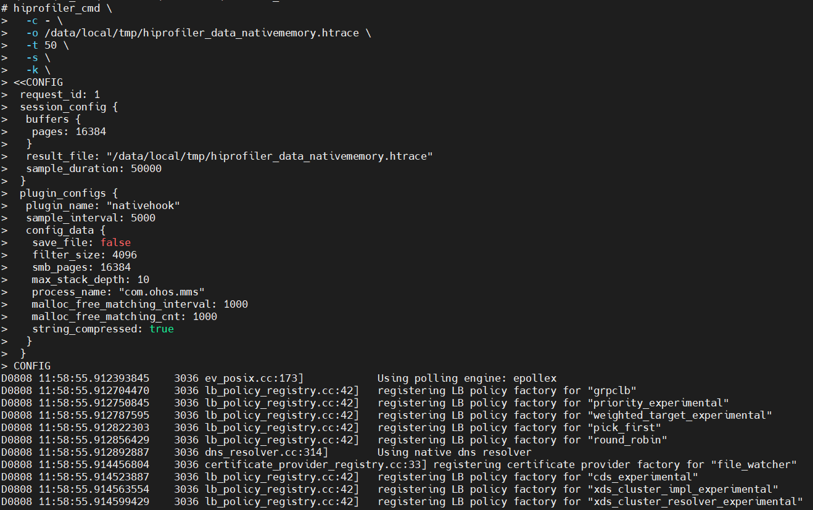
执行完成后，进入指定目录查看，在/data/local/tmp 下就会生成 trace 文件。

## Native Memory 展示说明

将抓取的 nativememory 文件导入到 smartperf 工具中查看，查看内存的分配和释放等情况。

### Native Memory 泳道图展示类型

点击齿轮状的图标可以设置内存的展示单位。

-     Current Bytes：以申请内存的size绘制泳道图。
-     Native Memory Density：以申请内存的数量绘制泳道图。
-     All Heap&AnonuymousVM：malloc分配和mmap分配的总量。
-     All Heap：malloc分配的内存。
-     All Anonymous VM：mmap分配的内存。

### Native Memory 泳道图的框选功能

可以对内存的数据进行框选，框选后在最下方的弹出层中会展示框选数据的统计表格，总共有四个 tab 页。
Statistics 的 Tab 页，主要显示了统计明细类型。

-     Memory Type：内存的类型。
-     Exsiting：框选区域内申请没有释放的大小。
-     #Exsiting：框选区域内申请没有释放的次数。
-     Transient：框选区域内释放的大小。
-     #Transient：框选区域内释放的次数。
-     Total Bytes：框选区间内申请的大小。
-     #Total： 框选区间内申请的次数。
-     Peak Value： 框选区间内内存申请的峰值。
-     Exsiting/Total：框选区间内剩余的内存比上申请的内存，其中浅紫色是框选区间内申请的大小/整个时间轴（申请+释放的总大小)，深紫色是框选区间内(申请+释放)的大小/整个时间轴（申请+释放的总大小）。

Call Info 的 Tab 页，主要显示了调用树详细类型。

-     Symble Name：每个内存分配的调用栈。
-     Size：分配的总大小。
-     Count：相同调用栈出现的次数。
  Native Memory 的 Tab 页，主要显示了单次分配信息列表。
  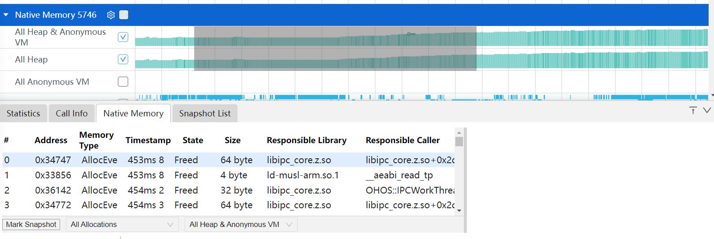
-     Address：内存块的地址。
-     Memory Type：内存分配的类型。
-     Timestamp：时间戳信息。
-     State：内存地址当前状态Existed 表示框选范围内未释放，Freed表示已释放。
-     Size：该次申请分配内存的大小。
-     Responsible Library ：调用该函数的库。
-     Responsible Caller  ：调用该函数的方法。
  Snapshot List 的 Tab 页，主要显示了各时刻内存的增长的差值。
  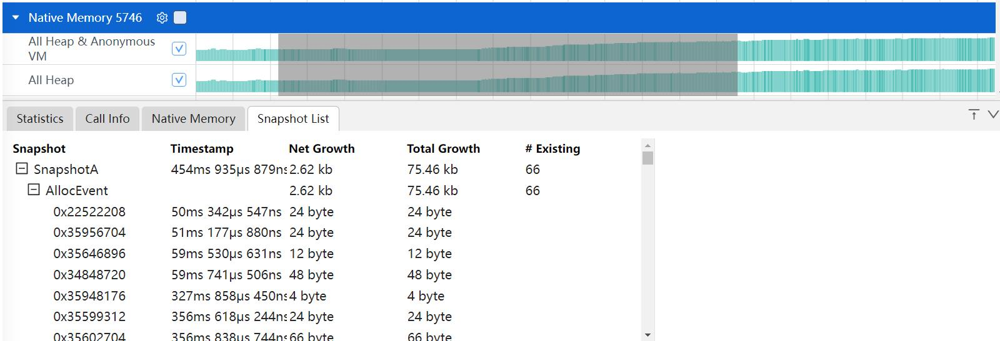
-     Snapshot：标记的打点说明。
-     Timestamp ：时间戳信息。
-     Net Growth ：自从上次Snapshot的增长量，是计算的分配和释放的。
-     Total Growth ：自从上次Snapshot的增长量，是计算的每一次分配的。
-     #Exsiting  ：仍然存在的内存数。

### Native Memory 的辅助信息功能

在 Call Info 和 Native Memory 的 Tab 页，点击选中某一行，右边画红线处会显示出该行调用栈的树结构信息。
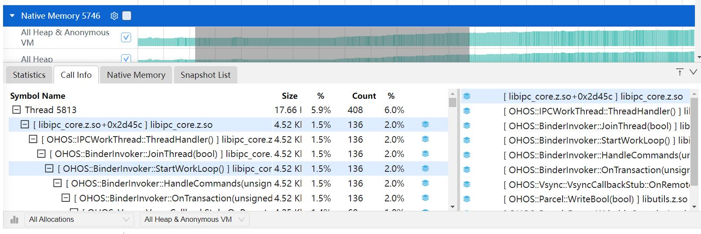

### Native Memory 详细显示的过滤功能

点击下方的 All Allocations 可以对 Allocation 的 lifeSpan 进行过滤，有三个选择：All Allocatios，Create & Exsiting，Create & Destroyed。
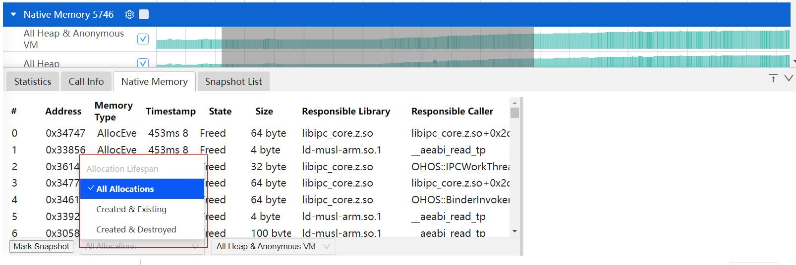

-      All Allocations：所有的内存。
-      Created & Exsiting：创建且被存活的内存。
-      Created & Destroyed： 创建且被销毁的内存。
  点击下方的 All Heap&Anonymous 可以对内存类型进行过滤。
  
-     All Heap&AnonuymousVM：Heap和AnonuymousVM的总量。
-     All Heap：malloc分配的内存。
-     All Anonymous VM：mmap的匿名页。
  点击下方的 Mark Snapshot 可以在时间轴上打标签。出现小旗的标志，通过标注多个时间点。点击到 Snapshot List 标签页可以看到各个时间点的内存的增长值。
  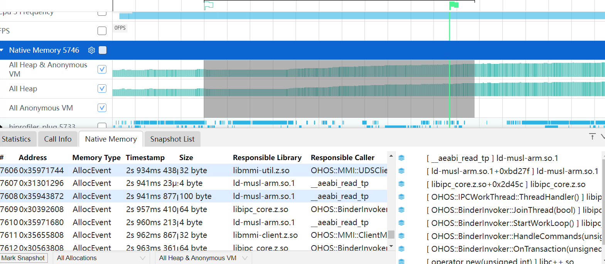

### Native Memory 的火焰图功能

点击 callinfo 左下角的柱状图的图标，会切换到火焰图页面。
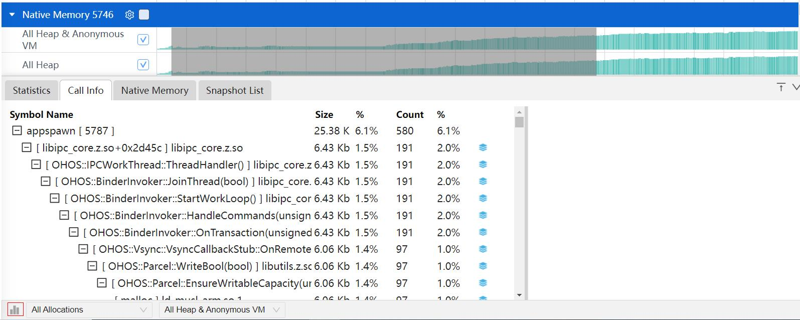
进入到火焰图页面，火焰图的展示跟 Callinfo 的 tab 页的调用栈显示一致，鼠标放到色块上，悬浮框可以显示调用栈名称和 size 大小。
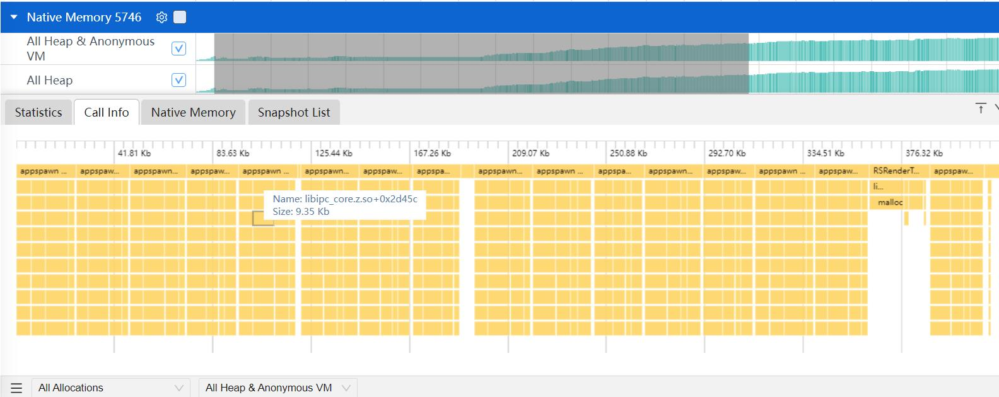
鼠标左键火焰图，会进入下一级界面，右键回到上一级。
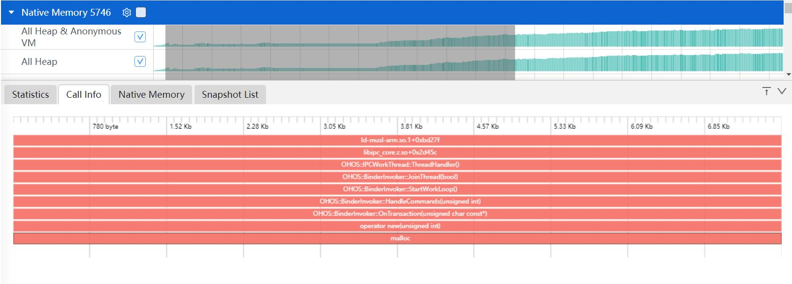

### Native Memory 数据统计功能

选择 Use Record Statistics 和 statistics interval 配置项抓取的数据，只会显示 Call Info 的 Tab 页，Call Info 相关功能同上。

