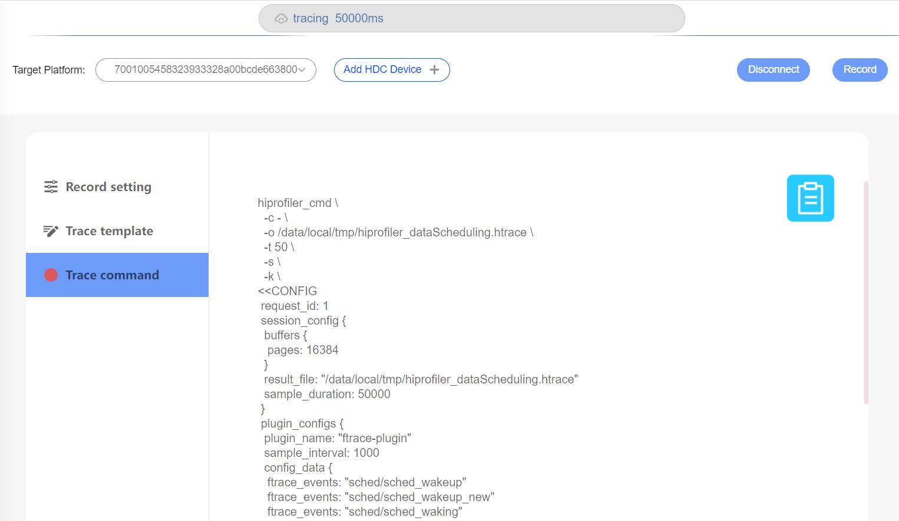
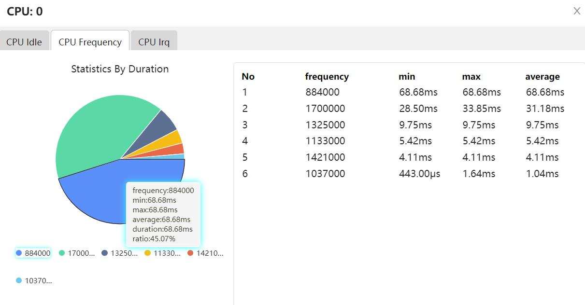
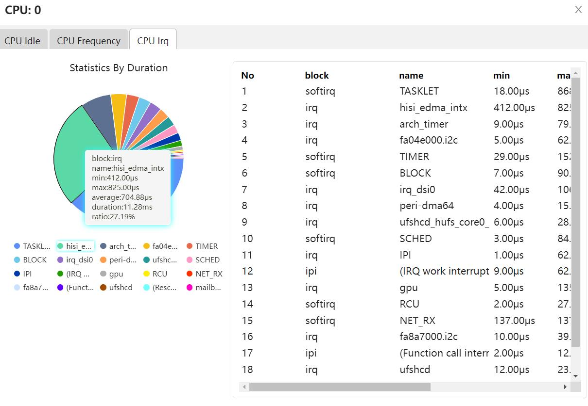
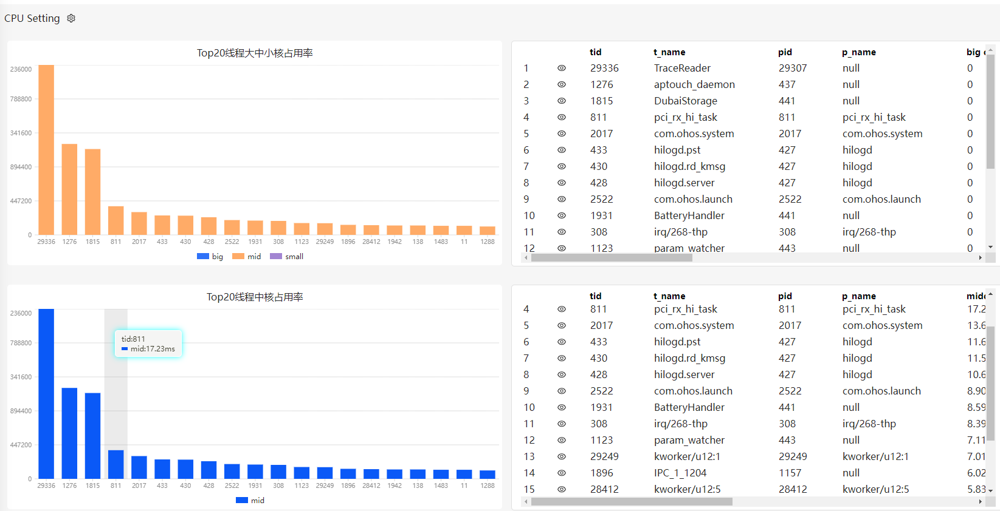
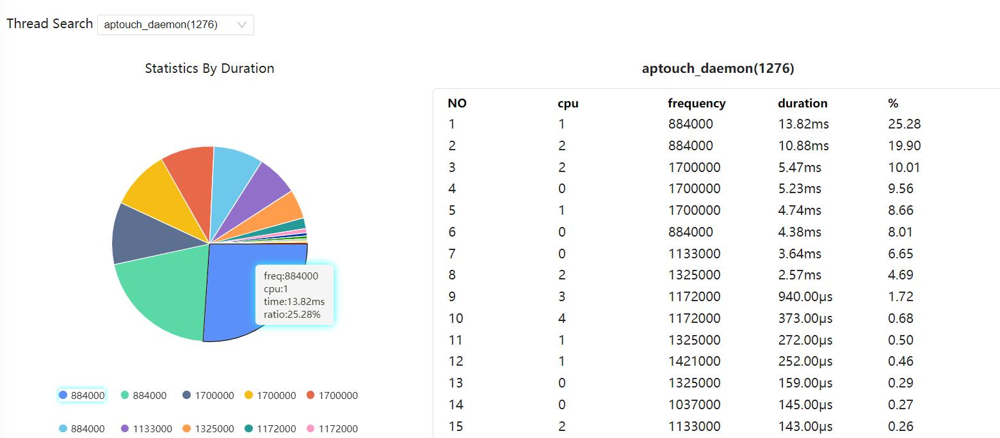
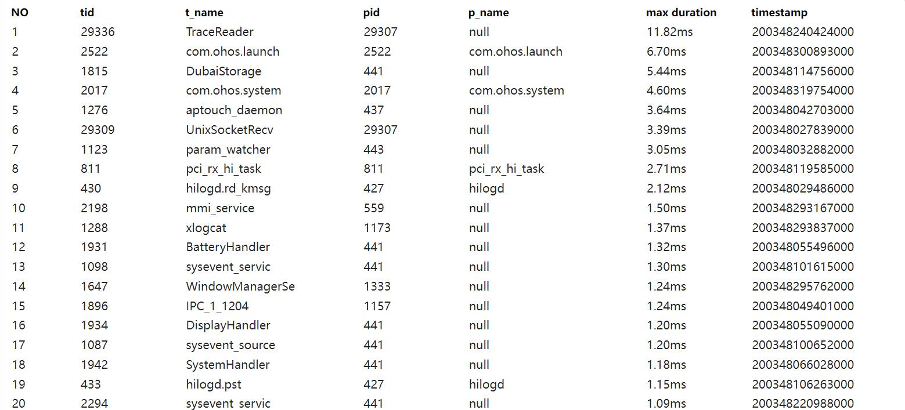

# Scheduling analysis 抓取和展示说明

抓取和展示 CPU 调度分析，线程调度分析相关数据。

## Scheduling analysis 的抓取

### Scheduling analysis 抓取界面配置说明

打开 Scheduling analysis 开关抓取调度分析数据。

### Scheduling analysis 文件的抓取

点击 Record setting，在 output file path 输入文件名 hiprofiler_dataScheduling.htrace，拖动滚动条设置 buffer size 大小是 64M，抓取时长是 50s。

点击 Trace command，就会根据上面的配置生成抓取命令，点击 Record 抓取，抓取过程中会显示抓取时长。

## Scheduling analysis 功能介绍

将抓取的文件导入到 smartperf 工具查看。

### CPU 频点分析

点击下拉列表框选择 CPU Frequency，可以看到各核 CPU 的各频点持续时长的占比图，以颜色区分各频点。

点击 CPU Frequency 饼图，可以跳转到详细信息界面，用饼图和表格来展示某个 CPU 下各频点持续时长的的相关数据。

-     No：编号。
-     frequency：频率。
-     min：最小时长。
-     max：最大时长。
-     average：平均时长。
-     duration：运行总时长。
  点击详细页的 CPU Frequency 饼图，可以跳转某个 CPU 下某个频点的运行的线程信息。
  
-     No：编号。
-     t_name：线程名。
-     tid：线程id。
-     p_name：进程名。
-     p_pid：进程id。
-     duration：运行总时长。

### CPU Idle 分析

点击下拉列表框选择 CPU Idle，可以看到各 CPU 的 Idle 的时长占比饼图，以颜色区分各 Idle。

点击 CPU Idle 饼图，可以跳转到某 CPU 的 idle 分析的详细数据，以饼图和表格的形式展示。

-     No：编号。
-     idle：idle值。
-     min：最小时长。
-     max：最大时长。
-     average：平均时长。
-     duration：运行总时长。

### CPU Irq 分析

点击下拉列表框选择 CPU Irq，可以看到各 CPU 的 Irq 的时长占比饼图，以颜色区分。

点击 CPU Irq 饼图，可以跳转到某 CPU 的 Irq 分析的详细数据，以饼图和表格的形式展示。

-     No：编号。
-     block：irq的类型。
-     name：irp名称。
-     min：最小时长。
-     max：最大时长。
-     average：平均时长。
-     duration：运行总时长。

### CPU 占用率显示

以表格显示各 CPU 的占用率。

### Top20 线程大中小核占用率

选择 Thread Analysis 标签页，各个 CPU 通过勾选 big 或者 middle 或者 small 来设置 CPU 的分类。

各 CPU 勾选好大中小核，点击 Upload 可以跳转到各个线程 CPU 占用率情况的展示页面。

如上图所示：

-     三色柱状图：各个线程CPU的占用率情况，其中以颜色区分占用的大中小核的占用率情况，并以表格的形式展示各个线程的基本信息和大中小核占用率。
-     单色柱状图：分别统计线程在某一个类别（大、中、小）的CPU的占用率，并显示出线程的基本信息和占用率。
  表格的字段说明：
-     tid：线程号。
-     t_name：线程名。
-     pid：进程号。
-     p_name：进程名。
-     big core：大核占用时长。
-     middle core：中核占用时长。
-     small core：小核占用时长。
-     cpu..(us)：运行总时长(..代表cpu号)。

### 单个线程频点分布

点击单个线程频点分布的标签，通过在 Thread Search 选择线程，来展示单个线程的频点分布情况。

-     NO：编号。
-     cpu：cpu编号。
-     frequency：频点。
-     duration：运行时长。
-     %：频点占用率。

### Top20 单次运行超长线程

通过点击 Top20 单次运行超长线程标签，显示线程的单次运行时长来统计出单次运行时长最大的 20 个线程。

-     NO：编号。
-     tid：线程号。
-     t_name：线程名。
-     pid：进程号。
-     p_name：进程名。
-     max duration：最大运行时长。
-     timestamp：时间戳信息。

### Top20 进程线程数

通过点击 Top20 进程线程数标签，显示线程数量最多的 20 个进程，以饼图和表格方式显示。

-     NO：编号。
-     pid：进程号。
-     p_name：进程名。
-     thread count：线程数量。

### Top20 切换次数线程

通过点击 Top20 切换次数线程标签，显示切换次数最多的 20 个进程，以饼图和表格方式显示。

-     NO：编号。
-     tid：线程号。
-     t_name：线程名。
-     pid：进程号。
-     p_name：进程名。
-     sched_switch count：切换次数。
