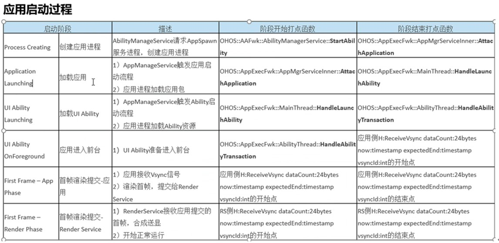

# 应用启动数据说明

TraceStreamer支持解析应用启动数据，数据包含应用拉起的6个阶段及相关的调用栈信息，分别为Proess Creating(创建应用进程)，Application
Launching(加载应用)，UI Ability Launching(加载UI Ability)， UI Ability OnForeground(应用进入前台)，First Frame-App Phase(首帧渲染提交-应用)，First Frame-Render Phase(首帧渲染提交-Render Service)。

应用启动每个阶段的开始和结束时间如图：

前四个阶段对应的标志事件字符串：
Proess Creating：在callstack表中查找包含"H:int OHOS::AAFwk::MissionListManager::StartAbilityLocked("的字符，并且向上的调用栈包含"H:virtual int OHOS::AAFwk::AbilityManagerService::StartAbility("字符的数据，即为启动第一阶段。该数据中第一个'##'之后的字符串即为该应用的名称。

Application Launching：在callstack表中查找包含"H:virtual void OHOS::AppExecFwk::AppMgrServiceInner::AttachApplication(const pid_t, const sptrOHOS::AppExecFwk::IAppScheduler &)##"字符的数据，即为启动第二阶段。该数据中第一个'##'之后的字符串即为该应用的名称。

UI Ability Launching：在callstack表中查找包含"H:void OHOS::AppExecFwk::MainThread::HandleLaunchAbility(const std::shared_ptr `<AbilityLocalRecord>` &)##"字符的数据，即为启动的第三阶段，在这个阶段会上报包名和拉起该应用的ipid。如数据中缺少此阶段，可视为应用未启动。

UI Ability OnForeground：在callstack表中查找包含"H:void OHOS::AppExecFwk::AbilityThread::HandleAbilityTransaction(const OHOS::AppExecFwk::Want &, const  OHOS::AppExecFwk::LifeCycleStateInfo &, sptrOHOS::AAFwk::SessionInfo)##"字符的数据，即为启动的第四阶段，该阶段会上报ipid，同一个应用第三和第四阶段上报的ipid相同。

后两个阶段的计算方式如下：

First Frame-App Phase：使用第三阶段得到的ipid关联到frame_slice表中，取到该ipid对应的应用帧的首帧数据，即为该应用第五阶段的数据。

First Frame-Render Phase：通过应用帧首帧数据，可以在frame_slice表中通过dst字段关联到渲染帧首帧数据，即为该应用的第六阶段的数据。
